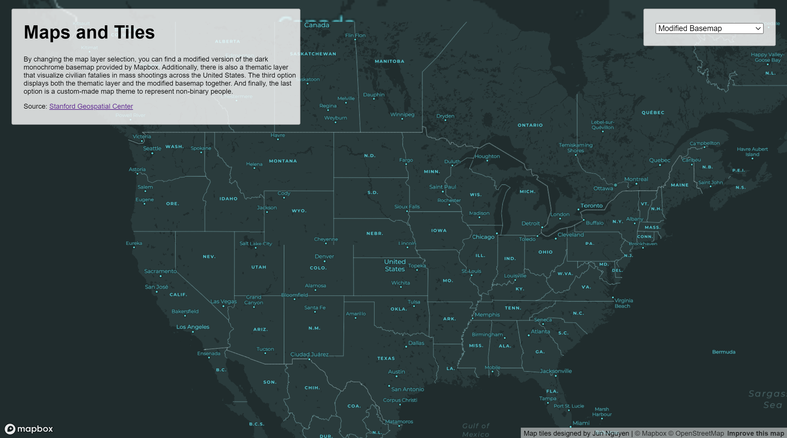
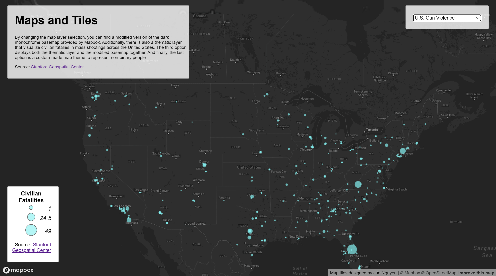
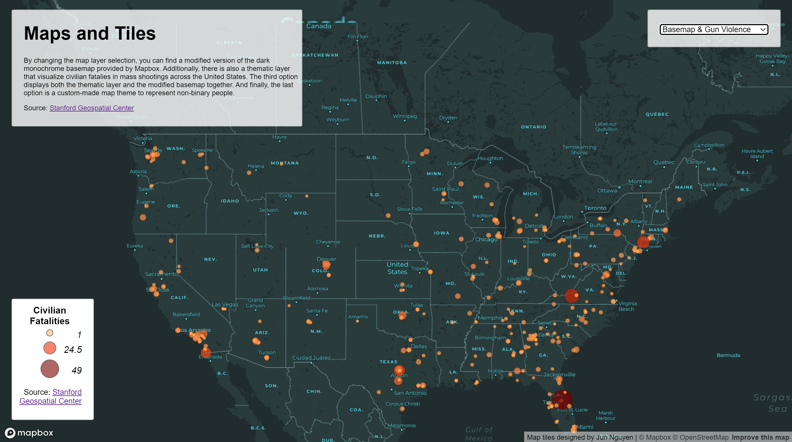
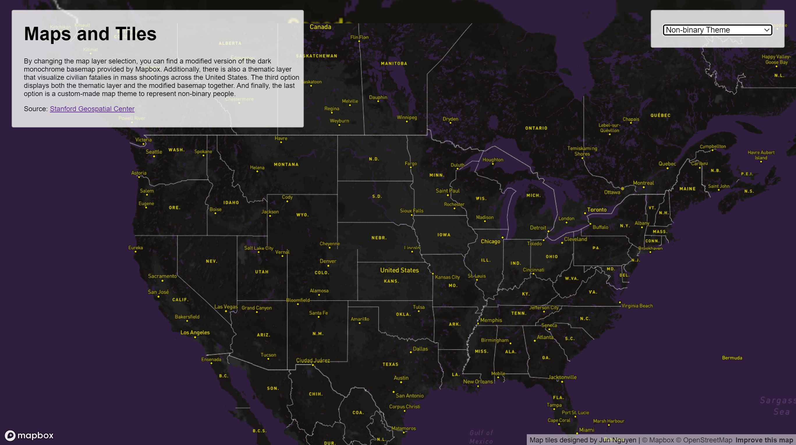

# Maps & Tiles

This web map contains four layers: a modified basemap, a thematic layer, the modified basemap
and thematic layer combined, and a custom themed basemap. 

To view the web map, click [here](https://soshikun.github.io/map-tiles/)!

## Examined Geographic Area - United States
The examined geographic area for this web map is the United States. This is because the dataset used
only contains data on the United States.

## Zoom Level
The zoom levels for each tile set is the same. The minimum zoom available is 1, and the maximum
zoom available is 10.

## Layer 1 - Modified Basemap
The first layer is the modified basemap. This basemap takes Mapbox Studio's dark monochrome basemap
as a base and the pushes the colors up a bit to make it more cyan/green. This modified basemap is
intended for those who want to display their data on a dim basemap, but not the point that it is
pitch dark like the original dark monochrome basemap.

## Layer 2 - U.S. Gun Violence
This layer is the thematic layer, utilizing mass shooting data from [Stanford Geospatial Center](https://github.com/StanfordGeospatialCenter/MSA).
This thematic layer uses dot size to represent the number of civilian fatalities in the United
States. The larger the dot, the more civilian fatalities there are.

## Layer 3 - Modified Basemap & U.S. Gun Violence
This layer takes both the modified basemap and the thematic layer and combines them into one.
It shows the civilian fatalities layer on the dim monochrome basemap created from the first layer.

## Layer 4 - Custom Theme - Nonbinary Theme
This layer is a custom-made layer designed over Mapbox. It reflects my personal research interests,
which are LGBTQ+ studies and geographic studies. Combining both, I designed this layer with the
colors of the nonbinary flag. I chose to keep the color contrast simple, so I used purple, yellow,
and black, which are the colors of the nonbinary flag. I chose to make land bodies black to keep the
dark theme. I used yellow to highlight text, like places of interest and states/cities' names. And
finally, I used purple to highlight the water bodies to bring out the land bodies more.

